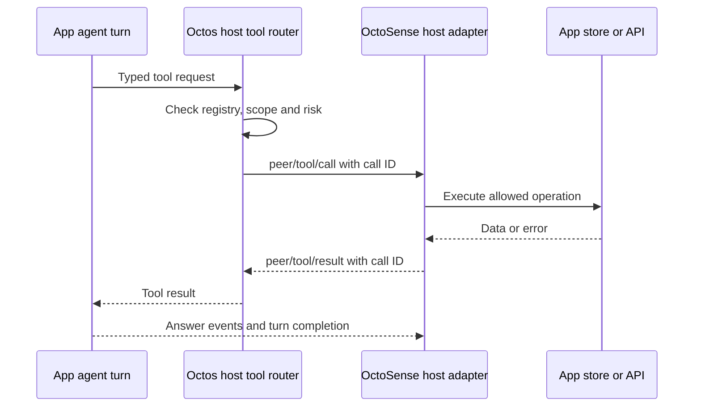

# OctoSense integration: agents, sessions, tools and Tokio

This walkthrough starts from Rust concepts and follows the code implementing
host-owned app peers. It complements [the runtime architecture](ARCHITECTURE.md)
and [OUP specification](../api/OCTOS_UI_PROTOCOL_V1_SPEC_2026-04-24.md).

## Revision boundary

The Octos checkout inspected is `a2dfd6c7700016d5e31a245a7c422b970280626f`.
The accompanying OctoSense workspace pins `octos-core`, `octos-cli` and
`octos-research` to `ae230ce04d57f3c29cf6c2518e5956a86c07d788`. They are different
revisions. Comparing the pin against this checkout found no differences in
`embedded.rs`, `api/ui_protocol_transport.rs`, `peers/app_binding.rs`, or
`peers/host_tools.rs` under `crates/octos-cli/src`. Other surfaces must be
checked against the consuming pin before relying on newer checkout behavior.
Do not silently change dependency revisions while following this guide.

## Vocabulary before code

| Term | Meaning here | Rust/runtime counterpart |
| --- | --- | --- |
| Agent | Model-driven loop that reads context, calls tools and produces an answer | `octos_agent::Agent` and its async processing methods |
| System agent | Product role that coordinates the host and its apps | A host-selected session/profile and tool policy; not an OS daemon by definition |
| App peer | Host-owned agent identity bound to one app/account scope | Durable peer binding, sessions and registered tools |
| Session | Addressed conversation, history and execution scope | `SessionKey`, transcript/context stores and runtime registries |
| Turn | One admitted request and its model/tool processing | Async orchestration and agent futures, interrupt state and IDs |
| Tool | Typed operation a model can request | Registry entry, arguments, permissions, execution and result |
| Tokio task | Independently scheduled Rust future | `tokio::spawn`/`JoinHandle`, not a persistent agent identity |
| OS thread | Runtime worker or dedicated blocking worker | Executes polls or blocking work; not one per agent |

An LLM does not directly hold an app database handle. It proposes a tool call;
Rust code checks and executes that operation. An agent can be idle without a
running turn, and one active turn can create several tasks. Persistent identity,
session lifetime and task lifetime are different.

## Find the layers

Read these files in order:

1. [OUP types](../crates/octos-core/src/ui_protocol.rs): commands, events,
   `SessionKey` references, turn IDs, `TurnOrigin` and peer notifications.
   OUP is JSON-RPC request/response plus notifications. A response to
   `turn/start` acknowledges admission; it is not the final natural-language
   answer. Consume turn/message events and terminal state too.
2. [Local runtime bootstrap](../crates/octos-cli/src/runtime/local_oup.rs):
   builds runtime state from a configured profile/provider. A provider is the
   model transport; it is not the UI and not the application's data store.
3. [OUP transport and dispatcher](../crates/octos-cli/src/api/ui_protocol_transport.rs):
   WebSocket/stdio connection loops, session opening, admission, subscriptions,
   `run_standalone_turn`, event forwarding and shutdown.
4. [Peer app binding](../crates/octos-cli/src/peers/app_binding.rs): canonical
   workspace, memory namespace, host token and request-context bindings.
5. [Host tools](../crates/octos-cli/src/peers/host_tools.rs) and
   [tool wrapper](../crates/octos-agent/src/tools/peer_host_tool.rs): registration,
   tool confinement, risk gating, outbound host calls and correlated replies.
6. [Agent loop](../crates/octos-agent/src/agent/loop_runner.rs): model requests,
   tool batches, history/context updates, convergence, budgets and output.
7. [Turn origins](../crates/octos-cli/src/peers/turn_origin.rs) and
   [shared history](../crates/octos-cli/src/peers/shared_history.rs): who is
   speaking and how human/system lanes see bounded context from each other.

## App peer creation and app data access

A host uses `peer/prepare` with a host binding. The durable binding fixes the
app's canonical `cwd` and `memory_namespace`; the kernel creates a host token
and stores its digest. Later control calls must present the token. Merely
knowing or choosing the system agent's session ID is insufficient authority.
Opening the app peer under a different workspace is refused.

The host then uses `peer/tools/register` to register app operations and an
optional `generic_tools` list. Registration is versioned and replaced as a
whole; it is persisted in `host_tools.json`. `generic_tools` narrows kernel
tools already available to the peer; it cannot create arbitrary new tools.
A stored set is not permission for every caller to drive the app. The code
checks the owning host connection and fails closed for unauthorized turns.

For example, an app could expose `mail.search` with a JSON input schema. The
model supplies arguments. `HostRoutedTool` applies its risk/approval rules;
`TurnHostToolRouter` sends `peer/tool/call` to the registered host. The **host's
service or app adapter** accesses its actual database/account API and answers
`peer/tool/result`. The result is fed into the agent loop, which can explain
it to the requester. `mail.search` here illustrates the contract; consult the
installed app's declarations for its actual names and schemas.



The reply wait uses a Tokio `oneshot` channel, with timeout and interrupt
handling. The router can emit `peer/tool/cancel`; an interrupted write can have
an unknown outcome, so cancellation must not be described as rollback. Pending
calls are bounded and tool calls are audited in `tool_audit.jsonl`.

**App records, transcript and agent memory are three stores.** App records
belong to host app services. Session transcripts preserve the conversation.
The peer memory namespace scopes agent memory capture/retrieval. A memory
namespace does not automatically grant SQL or filesystem access to all app
records. Generic file tools only exist if the effective tool policy allows
them; they are not a substitute for app-service authorization.

A host may register an allowed tool owned by another app on this peer, using
the declaration's `app` owner field. That is an explicit host-mediated
cross-app route. `shareable` metadata alone is not a kernel grant and does not
make every other app's tools callable. Likewise, using the system agent
requires a concrete exposed coordination tool/route; peers do not gain an
unrestricted function pointer to their originator. Check the consuming
OctoSense App Hub and app-peer policies for the supported product routes.

## System agent and human conversations

For a host-owned peer, the system agent's `peer_send_input` is delivered as
**`peer/input` to the host**. The kernel does not bypass the app host and start
an unrestricted peer turn. The host accepts/routes that input and starts the
bound app turn. `host_tools::deliver_peer_input`, `start_peer_input_turn` and
`await_peer_input_answer` are the useful trace points. The answer must remain
correlated to that input/turn; a later human answer must not settle it.

The human can also address the app agent through the app's UI or cards. The
host submits a turn with `origin.kind = person`; `app` identifies app-initiated
work. Only the owning connection may set origin on eligible sessions, and it
cannot spoof `system_agent`: the kernel derives that origin from its own
peer-input delivery. `turn_origin::label_prompt` adds stable speaker markers
for the model/transcript and prevents a person's turn from spuriously waking
the system agent.

There are two relevant conversation arrangements:

- A person and system agent can use the peer conversation with distinct turn
  origins, subject to that session's active-turn admission.
- For concurrent interaction the host opens a request context using
  `peer/context/open` with `share_history`. The peer's own session is the
  system lane; the context session is the person lane. Each has its **own
  transcript**, so simultaneous writers cannot corrupt tool-call pairing or
  compaction. Shared history is a bounded, labelled, read-only projection of
  recent user/assistant text and in-progress status; it omits tool rows. It is
  not copied into the other lane's durable transcript. A context does not see
  its sibling contexts through this mechanism.

A request context **is a session**, with a derived key such as
`<originator base>#peerctx-<slug>.<context_id>`, its own workspace beneath the
peer workspace and child memory namespace. It is not a new app peer. A closed
or unknown context is rejected at bootstrap and turn start. Creating one does
not mean creating another OS thread. Mini-apps hosted by an app can also use
such contexts; whether a context shares history is an explicit host choice.

Answers reach the appropriate frontend as OUP events. System-input results
also feed the peer coordination/blackboard path; origin and correlation decide
which requester is being answered. Avoid implementing this by forwarding every
text delta to every requester indiscriminately.

## How this maps onto Tokio

A future only makes progress when polled. At `.await` it can yield its worker
thread while waiting for I/O or another channel. `tokio::spawn` gives a future
an independent task; `.await` by itself does not create one. A `JoinHandle`
lets the owner observe completion or abort; dropping a handle alone does not
mean the task finished. A `CancellationToken` is cooperative notification.

The source contains several runtime paths, so a single “one agent = one task”
diagram would be misleading:

| Path | Owners, tasks and channels |
| --- | --- |
| OUP WebSocket | `ui_protocol_connection` splits the socket; a bounded Tokio `mpsc` queue feeds a spawned `WsConnection::writer_loop`. The async connection loop dispatches input and owns per-connection turn/forwarder handles. |
| OUP stdio, including the generic embedded adapter | `stdio_connection_with_io_policy` reads NDJSON asynchronously, but output uses a bounded **standard-library `sync_channel` and dedicated OS thread**, `octos-appui-stdio-writer`. That thread uses a current-thread Tokio runtime to drive the async writer; a `oneshot` reports completion. |
| Admitted OUP turn | `handle_turn_start_with_accept` creates an interrupt `mpsc` channel with capacity 1 and a `oneshot` start barrier, spawns orchestration, records ownership/admission, then allows work to start. The active-turn registry serializes conflicting work per session; it does not lock all peers together. |
| Agent processing within an OUP turn | `run_standalone_turn` spawns the `process_message_tracked_with_attachments` future and coordinates output, interrupts, approvals and terminal persistence. Progress/failover/heartbeat work can add tasks. Tool calls may add concurrency of their own. |
| Host app tool request | A pending call stores a reply `oneshot`; `tokio::select!` handles result, cancellation and timeout. Waiting is asynchronous; the app's actual operation runs wherever its host adapter schedules it. |
| CLI `chat --peers` | `OupPeerHost` stores `(CancellationToken, JoinHandle)` per presented peer. `serve_peer` opens/listens to a child OUP session and closes it on cancellation. This frontend task is additional to backend turn tasks. |
| Gateway/session actor path | `ActorFactory` in `session_actor.rs` creates a bounded `ActorMessage` inbox and outbound proxy queue, spawns `actor.run()` and an outbound forwarder. Agent turns and stream forwarding can spawn further tasks. This actor implementation is not proof that every OUP session uses that same mailbox. |

`Arc` shares ownership of state; it does not execute work. Mutexes protect
registries or state transitions; inspect their scope before assuming the lock
is held while a model request runs. The shared-history live-turn registry,
for example, uses a short ordinary mutex and holds none across `.await`.

Blocking work needs a separate decision. Examples include SQLite cost-ledger
operations in [cost_ledger.rs](../crates/octos-agent/src/cost_ledger.rs), which
use `spawn_blocking`, and stdio output's dedicated thread. Do not conclude that
all filesystem/database operations in the kernel are automatically offloaded.
Do not block the native UI thread waiting for a turn or host tool result.

## Hosting and running

The following commands are source-derived starting points, **not commands
executed as part of this documentation pass**. Run from the Octos root with
Rust/Cargo and platform prerequisites installed:

```sh
cargo build --release -p octos-cli --no-default-features --features api --bin octos
target/release/octos --help
target/release/octos serve --help
target/release/octos serve --stdio
```

The `api` feature is necessary for the OUP server; disabling default features
avoids enabling every optional default integration. This is still a substantial
native build. Set up the intended configuration/profile/provider before
requesting a model turn. `serve --stdio` is a protocol server waiting for JSON
frames, not an interactive chat prompt; keep stdout for protocol traffic and
use an OUP client. A WebSocket client uses `/api/ui-protocol/ws` with the host's
authentication and feature negotiation. Inspect `serve --help` for listener
options for your pinned binary rather than copying another deployment's port.

For generic in-process embedding, [embedded.rs](../crates/octos-cli/src/embedded.rs)
exports `serve_io(home, reader, writer)`: no child executable and no network
listener. It requires a stored `_main` model profile and uses a private home
(`.octos` and `.config/octos` below it). The caller owns the Tokio runtime.
Its documented worker-stack requirement is **8 MiB**:

```rust,ignore
let runtime = tokio::runtime::Builder::new_multi_thread()
    .enable_all()
    .thread_stack_size(8 * 1024 * 1024)
    .build()?;
// Move owned home/reader/writer into a task on this runtime.
let serving = runtime.spawn(async move {
    octos_cli::embedded::serve_io(&home, reader, writer).await
});
```

This snippet shows runtime ownership, not a complete app or provider setup.
Do not directly `block_on(serve_io(...))` on a small-stack UI/caller thread:
`block_on` polls that future on the calling thread. The embedded module has a
fixture test covering session opening and pipe-close shutdown with the required
stack size. Closing a pipe/connection must run the transport cleanup, cancel
or settle owned work, and release its writer; durable peer records are a
separate lifetime.

OctoSense selects launch modes through its own `crates/kernel` supervisor,
including child-process/remote/embedded choices by platform/configuration.
The existence of this generic embedded API does not imply every OctoSense
platform uses it. Follow the
[OctoSense walkthrough](https://github.com/OctoSense-org/OctoSense/blob/main/docs/architecture-walkthrough.md)
for desktop/home/ROM commands and the actual app-to-kernel bridge.

## Useful regression-reading and validation

[Host-tool protocol tests](../crates/octos-cli/src/api/ui_protocol_peer_host_tools_tests.rs)
exercise registration, connection ownership, dispatch and failure boundaries.
The embedded module's tests cover profile requirements and pipe lifecycle.
`session_actor_tests.rs` covers the separate actor implementation. Read the test
name and feature gates before selecting a narrow Cargo test; an unrun recipe
is not proof that a peer can access a real app account or device.

For documentation changes, check local links, referenced symbols, revision
comparisons and `git diff --check`. Rust/GUI/provider tests are required only
when relevant code or runtime behavior changes; report which were actually run.
