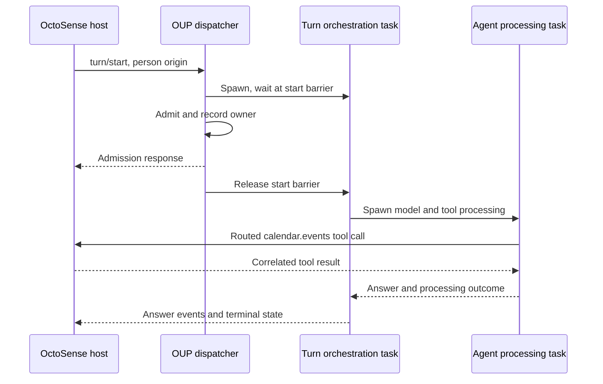

# OctoSense integration: agents, sessions, tools and Tokio

OctoSense supplies the app UI and app services. Octos runs the agent that
interprets a request, calls those services and returns an answer. This guide
follows one Calendar request through that boundary and the Rust tasks behind it.

The host and kernel communicate through **OUP**, the Octos UI Protocol: JSON-RPC
requests, responses and events over a connection. See the
[runtime architecture](ARCHITECTURE.md) and
[OUP specification](../api/OCTOS_UI_PROTOCOL_V1_SPEC_2026-04-24.md) for the wider
system. OctoSense selects an Octos revision in its root
[Cargo.toml](https://github.com/OctoSense-org/OctoSense/blob/main/Cargo.toml);
use that revision when tracing a running integration.

## Runtime concepts

| Term | Meaning here | Rust counterpart |
| --- | --- | --- |
| Agent | Model-driven loop that reads context, calls tools and produces an answer | `octos_agent::Agent` and its async processing methods |
| System agent | Product role that coordinates the host and its apps | A host-selected session, profile and tool policy |
| App peer | Host-owned agent identity bound to one app and account scope | Durable peer binding, sessions and registered tools |
| Session | Addressed conversation, history and execution scope | `SessionKey`, transcript and context stores and runtime registries |
| Turn | One admitted request and its model and tool processing | Async orchestration and agent futures, interrupt state and IDs |
| Tool | Typed operation a model can request | Registry entry, arguments, permissions, execution and result |
| Tokio task | Independently scheduled Rust future | `tokio::spawn` and `JoinHandle` |
| OS thread | Runtime worker or dedicated blocking worker | Executes polls or blocking work |

The model proposes a tool call; Rust code checks and executes the operation.
An agent can be idle without a running turn, and one active turn can create
several tasks. Its identity and conversation survive after those tasks finish.
A **profile** is the saved runtime configuration used to build an agent,
including its model/provider settings and defaults.

<a id="app-peer-creation-and-app-data-access"></a>

## Prepare the app peer

A host uses `peer/prepare` with a host binding. The durable binding fixes the
app's canonical working directory (`cwd`) and `memory_namespace`. A **memory
namespace** scopes which stored agent memories this app/account can capture and
retrieve. Octos also creates a peer capability token and stores its SHA-256
digest. The wire field is named `host_token`.
Control calls require that token; a session ID alone is not accepted. This peer
token is distinct from the server bearer credentials described below.
Opening the app peer under a different workspace is refused.

The host then uses `peer/tools/register` to register app operations and an
optional `generic_tools` list. Registration is versioned and replaced as a
whole and persisted in `host_tools.json`. `generic_tools` narrows the Octos
tools already available to the peer. The code checks the owning host connection
before allowing a host-driven turn to use the registered tools.

<a id="how-this-maps-onto-tokio"></a>

## Follow one Calendar request through Tokio

Suppose a person asks Calendar, “What is on my calendar today?” The host has
prepared Calendar's peer and opened the human conversation session described
below. Follow the request in
[the OUP dispatcher](../crates/octos-cli/src/api/ui_protocol_transport.rs):

1. **Submit and check the turn.** OctoSense sends `turn/start` for that session
   with the person's message and `origin.kind = person`. The dispatcher checks
   the session and connection scope before preparing work for that session.
2. **Register ownership before starting work.**
   `handle_turn_start_with_accept` creates a Tokio `mpsc` interrupt channel
   with capacity 1 and spawns an orchestration task. That task initially waits on a `oneshot` channel: a
   one-message channel acting as a **start barrier**. The active-turn registry
   checks for conflicting work. On admission, the dispatcher records the turn
   and its owner, sends the admission response, then releases the barrier. If
   admission or sending the response fails, it aborts the task.
   Acceptance means the request can run; answer events arrive later.
3. **Run the agent.** The released task calls `run_standalone_turn`, which spawns
   the agent processing future, `process_message_tracked_with_attachments`.
   The outer task coordinates output, interrupts and approvals while the inner
   task drives model and tool processing. For this example, assume the model
   chooses the registered
   [`calendar.events`](https://github.com/OctoSense-org/OctoSense/blob/main/apps/calendar/bundle/tools.json)
   tool with `from`, `to` and `limit` arguments. The model chooses a typed
   operation; it does not open Calendar's database itself.
4. **Ask the host for the data.**
   [`HostRoutedTool`](../crates/octos-agent/src/tools/peer_host_tool.rs) applies
   the tool's risk and approval rules.
   [`TurnHostToolRouter`](../crates/octos-cli/src/peers/host_tools.rs) sends
   `peer/tool/call` with a call ID to the owning host. OctoSense's Calendar
   service reads the permitted records and sends `peer/tool/result` with that ID.
5. **Wait without blocking a Tokio worker.** The pending tool call has its own
   reply `oneshot`. `tokio::select!` waits for the result, cancellation or
   timeout. While this future is waiting, the worker can poll other tasks.
   The host chooses where its database or API operation runs; the waiting
   future does not dictate a thread for that operation.
6. **Answer and finish.** The tool result returns to the agent loop, which can
   use it to write the answer. OUP message events and terminal state let
   OctoSense show the answer and completion in the person's conversation.
   The tasks finish; the peer binding and stored conversation remain available
   for the next request.



There is no fixed “one agent = one Tokio task” relationship. This request has
orchestration and agent tasks; event forwarding and other work can add tasks.
The Calendar peer is the longer-lived identity to which this work belongs.

On interruption, the router can emit `peer/tool/cancel`. For operations that
write data, cancellation may leave the outcome unknown: the host may already
have performed the write. Pending calls are bounded, and their audit records
are stored in `tool_audit.jsonl`.

## App data and cross-app tools

App records belong to host services; session transcripts preserve conversations;
the peer memory namespace scopes agent memory capture and retrieval. Database
access goes through a host adapter. Generic file tools depend on the effective
tool policy and workspace scope.

A host can register an allowed tool owned by another app using the declaration's
`app` owner field. Cross-app calls require that host authorization in addition
to `shareable` metadata. A peer reaches the system agent only through a
coordination tool the host registers. Follow OctoSense's
[`crates/app-peers`](https://github.com/OctoSense-org/OctoSense/tree/main/crates/app-peers)
and shell tool policies for the supported product routes.

## System agent and human conversations

For a host-owned peer, the system agent's `peer_send_input` is delivered as
`peer/input` to the host. The host validates and routes the input, then starts
the bound app turn. `host_tools::deliver_peer_input`, `start_peer_input_turn` and
`await_peer_input_answer` are the useful trace points. The answer must remain
correlated to that input and turn, separately from human conversation replies.

The human can also address the app peer through the app's UI or cards. The
host submits a turn with `origin.kind = person`; `app` identifies app-initiated
work. Only the owning connection may set origin on eligible sessions.
Octos reserves `system_agent` for its own
peer-input delivery. `turn_origin::label_prompt` adds speaker markers to the
prompt. `record_turn_origin` stores the origin by session and turn;
`is_person_turn` reads it when the dispatcher decides whether a pending question
should wake the system agent. A question from a human turn stays with the human.

There are two relevant conversation arrangements:

- A human and system agent can use the peer conversation with distinct turn
  origins, subject to that session's active-turn admission.
- For concurrent interaction the host opens a request context using
  `peer/context/open` with `share_history`. The peer's own session is the
  system lane; the context session is the human lane. Each has its own
  transcript, keeping each tool call beside its matching result. **Compaction**
  shortens the conversation supplied to the model as its context fills up;
  separate transcripts keep that process independent in each lane.

When `share_history` is enabled, each lane sees a bounded, labelled view of
recent user and assistant text and in-progress status from the other lane.
This shared view is read-only and omits tool-call and tool-result entries. It
is not copied into the receiving lane's durable transcript, and contexts do not
see their sibling contexts through this mechanism.

A request context is a session. Its key derives from the originating session,
for example `<originator base>#peerctx-<slug>.<context_id>`. It has its own
workspace beneath the peer workspace and child memory namespace. It is not a new app peer. A closed
or unknown context is rejected at bootstrap and turn start. Mini-apps can also
use such contexts; whether a context shares history is an explicit host choice.

Answers reach the appropriate frontend as OUP events. System-input results
also feed the **peer blackboard**, the result records used for agent
coordination. Origin and request/turn IDs identify which requester should
receive an answer.

## Peer lifecycle

The owning host controls the lifecycle through the dispatcher. A **model lane**
is a named model-routing choice from the configured profile. A **tombstone** is
a retained deletion record: it lets a retry recognize a peer that was already
purged.

| Method | Effect |
| --- | --- |
| `peer/model/set` | Selects a configured model lane, or clears the override. The change applies at the next turn; profile defaults and credentials stay intact. Unknown lanes are refused. |
| `peer/context/close` | Permanently closes a request context and interrupts its active turn. The transcript and workspace remain on disk under host retention policy. Repeating close is idempotent. |
| `peer/purge` | Erases transcripts, memory, control files and Octos-owned workspace data; invalidates stale sessions. Tombstones and an audit record survive so a retry with the same token can return `already_purged`. This is separate from deleting the app's business data. |

Read `raw_peer_model_set` and `raw_peer_context_close` in the dispatcher,
[the purge handler](../crates/octos-cli/src/api/ui_protocol_peer_purge.rs)
and [purge records](../crates/octos-cli/src/peers/purge.rs). A busy purge returns
`peer_purge_busy` with the peer closed; the host retries to finish cleanup.
OctoSense selects the model lane during peer preparation, closes released
contexts and requests purge on account removal. Its broker does not currently
expose `peer/model/set` as an app operation.

## Hosting and running

To build the server, run from the Octos root with Rust, Cargo and native build
prerequisites installed:

```sh
cargo build --release -p octos-cli --no-default-features --features api --bin octos
target/release/octos --help
target/release/octos serve --help
```

The `api` feature enables OUP serving. Configure a model profile before starting
a turn. A standalone protocol client can launch
`target/release/octos serve --stdio` and exchange JSON frames on stdin and
stdout. The [OctoSense launcher](https://github.com/OctoSense-org/OctoSense/blob/main/crates/kernel/src/launch.rs)
selects these modes:

| Platform or setting | Launch and transport |
| --- | --- |
| Desktop, Talk to Octos off | Explicit program or `OCTOS_APP_CORE_BIN`; `serve --stdio` with the shell's data directory and configuration. |
| Android, Talk to Octos off | Packaged `liboctos.so` executable; `serve --stdio` with the kernel home. |
| Desktop or Android, Talk to Octos on | The launcher replaces `--stdio` with `--host 127.0.0.1 --host-managed`. Native and permitted external clients share that child's WebSocket server. |
| OpenHarmony | In-process `octos_cli::embedded::serve_io` over a duplex pipe. |
| iOS | Kernel unavailable in this implementation. |

Talk to Octos is an explicit, persisted host setting. Its host-managed launch
passes two lines on stdin: the server host bearer token, then the external
client bearer token. Stdin stays open as a process lifeline. The host connects
to `/api/ui-protocol/ws` with its bearer token; external clients have a restricted
method and session scope. In particular, they cannot open host-owned app-peer
sessions. See [host-managed serve](HOST_MANAGED_SERVE.md) and
[its access checks](../crates/octos-cli/src/api/host_managed.rs).

Keep the credentials distinct:

| Credential | Scope and source |
| --- | --- |
| Server host bearer token | First stdin line in host-managed mode; authenticates the shell's server connection. |
| External client bearer token | Second stdin line in host-managed mode; authenticates permitted external clients with restricted access. |
| Peer capability token (`host_token` field) | Minted by `peer/prepare` for one host-owned peer; its digest is stored in the peer binding and checked on peer control calls. |

For generic in-process embedding, [embedded.rs](../crates/octos-cli/src/embedded.rs)
exports `serve_io(home, reader, writer)` over caller-supplied I/O. It requires a
stored `_main` model profile and uses a private home
(`.octos` and `.config/octos` below it). The caller owns the Tokio runtime.
Its worker-stack requirement is 8 MiB:

```rust,ignore
let runtime = tokio::runtime::Builder::new_multi_thread()
    .enable_all()
    .thread_stack_size(8 * 1024 * 1024)
    .build()?;
// Move the owned home path and I/O halves into a task on this runtime.
let serving = runtime.spawn(async move {
    octos_cli::embedded::serve_io(&home, reader, writer).await
});
```

Spawn the serving future onto that runtime: `block_on` would poll it on the
calling thread, whose stack may be smaller. Connection cleanup settles owned
work and releases the writer; peer persistence has a separate lifetime.
Follow the [OctoSense walkthrough](https://github.com/OctoSense-org/OctoSense/blob/61c668279a7c38a0f8056134d8d29e42ed715806/docs/architecture-walkthrough.md)
for desktop, Home and ROM commands and the app-to-kernel bridge.

## Reference: transport and other task arrangements

The Calendar trace above follows an OUP turn. These surrounding tasks depend on
how the host connects or which frontend runs the agent.

### OUP connection tasks

For WebSocket connections, `ui_protocol_connection` splits the socket. A bounded
Tokio `mpsc` queue (multiple senders, one receiver) feeds the spawned
`WsConnection::writer_loop`. The connection loop dispatches input and owns its
turn and event-forwarder handles.

For stdio, including the generic embedded adapter,
`stdio_connection_with_io_policy` reads newline-delimited JSON asynchronously.
Output uses a bounded standard-library `sync_channel` and a dedicated OS thread,
`octos-appui-stdio-writer`. That thread runs the async writer on a current-thread
Tokio runtime; a `oneshot` reports completion. It is an additional thread,
separate from the turn tasks in the Calendar example.

### Other frontends

| Frontend | Task ownership |
| --- | --- |
| CLI `chat --peers` | [`OupPeerHost`](../crates/octos-cli/src/commands/oup_peers.rs) stores a `CancellationToken` and `JoinHandle` per presented peer. `serve_peer` opens and listens to a child OUP session, then closes it on cancellation. This frontend task is additional to backend turn tasks. |
| Gateway | [`ActorFactory`](../crates/octos-cli/src/session_actor.rs) creates a bounded `ActorMessage` inbox and outbound proxy queue. It spawns `actor.run()` and an outbound forwarder; turns and streaming can add tasks. This session-actor path has its own ownership structure, separate from the OUP dispatcher. |

### Work that must not hold up the UI

The shared-history registry holds its mutex only briefly and releases it before
awaiting other work. Blocking SQLite cost-ledger operations use `spawn_blocking`
in [cost_ledger.rs](../crates/octos-agent/src/cost_ledger.rs). Native hosts keep
waits for turns and tool results off the UI thread. These choices let unrelated
requests and UI events proceed while an agent is waiting.

<a id="find-the-layers"></a>

## Reference: source map

Use these entry points when following a specific part of the request:

1. [OUP types](../crates/octos-core/src/ui_protocol.rs): commands, events,
   `SessionKey` references, turn IDs, `TurnOrigin` and peer notifications.
   OUP uses JSON-RPC requests, responses and notifications. `turn/start`
   acknowledges admission; subsequent message events and terminal state carry
   the answer and execution outcome.
2. [Local runtime bootstrap](../crates/octos-cli/src/runtime/local_oup.rs):
   builds runtime state from a configured profile and model provider.
3. [OUP transport and dispatcher](../crates/octos-cli/src/api/ui_protocol_transport.rs):
   WebSocket and stdio connection loops, session opening, admission, subscriptions,
   `run_standalone_turn`, event forwarding and shutdown.
4. [Peer app binding](../crates/octos-cli/src/peers/app_binding.rs): canonical
   workspace, memory namespace, peer token and request-context bindings.
5. [Host tools](../crates/octos-cli/src/peers/host_tools.rs) and
   [tool wrapper](../crates/octos-agent/src/tools/peer_host_tool.rs): registration,
   tool confinement, risk gating, outbound host calls and correlated replies.
6. [Agent loop](../crates/octos-agent/src/agent/loop_runner.rs): model requests,
   tool batches, history and context updates, convergence, budgets and output.
7. [Turn origins](../crates/octos-cli/src/peers/turn_origin.rs) and
   [shared history](../crates/octos-cli/src/peers/shared_history.rs): who is
   speaking and how human and system lanes see bounded context from each other.

## Tests

[Host-tool protocol tests](../crates/octos-cli/src/api/ui_protocol_peer_host_tools_tests.rs)
exercise registration, connection ownership, dispatch and failure boundaries.
The [embedded module tests](../crates/octos-cli/src/embedded.rs) cover profile
requirements, session opening and pipe-close shutdown with 8 MiB stacks.
[Session actor tests](../crates/octos-cli/src/session_actor_tests.rs) cover the
separate gateway actor implementation. Select focused tests by name and feature
gate using the commands in [CLAUDE.md](../CLAUDE.md).
